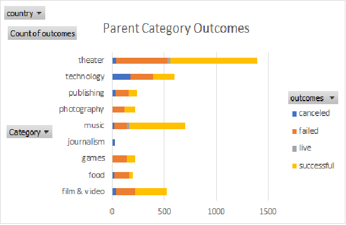

# This is the analysis of Kickstarter campaigns requested by the client. 
## Overview of Project
Louise, a playwright based in the US, is looking to start a crowd-funding campaign for her new play "Fever". Her preliminary analysis has led her to an estimated budget of over $10,000. 

###Louise has asked us to provide an analysis of past Kickstarter funding campaigns to inform her budget estimates. In addition, Louise has asked for an analysis of Kickstarter projects for musicals in Great Britain for a future project.

## Analysis and Challenges
I began this analysis with a large data set of Kickstarter projects covering multiple categories from 2009 through 2017. The size and variation of data wasn't helpful for the analysis I needed to focus on (projects funding theater plays in the US) so my first steps were to filter split the data and filter down to relevant parent category "Theater" and subcategory "Plays"). The view of the success rate of this category and subcategory provided positive feedback since they have historically been successful raising funds. Theater projects is a very successful category as displayed in the following bar graph 

Most of the challenges I faced were tactical trying to get syntax correct in Excel formulas. I solved those problems with some quick Google searches or by following the "hint" links provided in the module on Canvas. I did use the AskBCS Learning Assistance channel in Slack as well as setting up time with my tutor Earnest Long.

## Results
*The months with the highest number of successful Kickstarter campaigns are May and June. Starting in October successful projects decrease and failed projects increase. A number of factors could contribute to this and could be evaluated with further analysis. We recommend Louise initiate any Kickstarter campaign in these months. Please see the following chart 

*We recommend keeping her Kickstarter project goal around the US average which is approximately $5,000. This will place your project in the 75 percentile of successful projects. As a cautionary note, failed US projects have an avrage goal of around $10,000 with some very high outliers. The bottom line is that the higher your goal amount (particularly above $5,000) the more the likelyhood of failure. Please see th following chart 

*Please note that the data does stop at 2017 and therefore does not reflect recent market conditions considering the COVID pandemic. Nor does the data provide other potentially influencing factors such as economic health or GDP during the time periods covered.

*Regarding our analysis of Musicals in Great Britain. We strongly recommend reconsidering her planned goal of $4,000 funding for a musical in Great Britain. Our analysis shows that $4,000 is beyond the upper limits of successful pledged amounts. $2,000 is a more realistic goal amount while it is still in the upper quartile for pledged projects.
